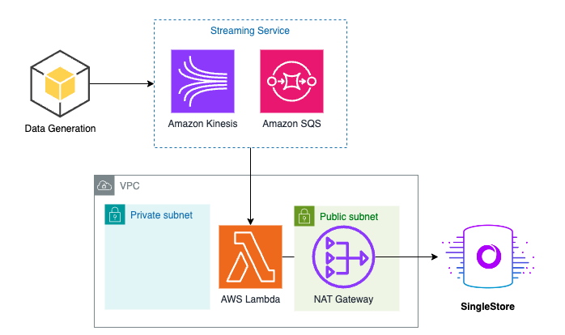

# kinesis-lambda-singlestore
Load data from Amazon Kinesis into SingleStore using AWS Lambda

This repo contains the code to walkthrough the blog: <INSERT_BLOG>.



## Launch Configurations

### Prerequisites

- git
- aws-cli
- aws-cdk >= 2.128.0
- node >= 21.6.1
- npm >= 10.4.0
- jq >= 1.7.1

### Deployment

Run the following command to build and deploy the application. Be sure to setup your AWS account using `aws configure`.

```bash
./scripts/deploy.sh
```

### Teardown

Once you are finished using the project, use the following command to delete the associated resources.

```bash
./scripts/teardown.sh
```

## Architecture Overview

### Code Layout

| Path                 | Description                                                    |
| :------------------- | :------------------------------------------------------------- |
| cdk/                 | AWS CDK source code.                                           |
| cdk/lambda/          | Lambda code.                                                   |
| data/                | Streaming data.                                                |
| scripts/             | shell scripts to build, deploy, and interact with the project. |
| singlestore/         | SQL commands to run in SingleStore.                            |
| assets/              | supporting pics and diagrams for documentation.                |